<!--
  McVarHQ / VAROON profile README
  Panel 1 (header) + Panel 2 (tech-stack wheel) are single animated SVGs.
  Panel 3 (repos) is a 2x3 grid of separate clickable card SVGs (inline 50%).
-->

<!-- ===================== PANEL 1: HEADER ===================== -->

  

<!-- ===================== PANEL 2: TECH STACK WHEEL ===================== -->

  

<!-- ===================== PANEL 3: REPOS (2x3 clickable) ===================== -->
<!-- prettier-ignore -->

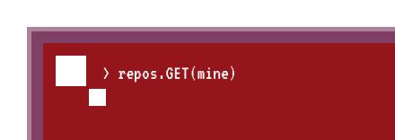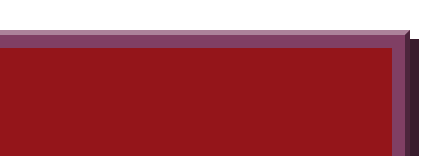<a href="https://github.com/McVarHQ/FairGavel">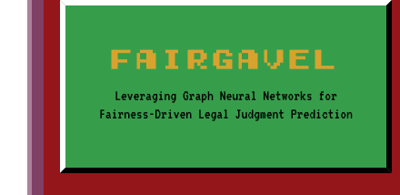</a><a href="https://github.com/McVarHQ/Potability-App">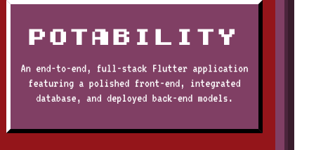</a><a href="https://github.com/McVarHQ/IRS-Sleep-Position-Prediction">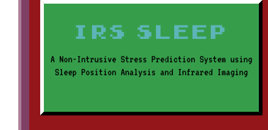</a><a href="https://github.com/McVarHQ/Unity-Projects">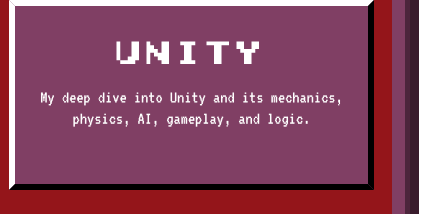</a><a href="https://github.com/McVarHQ/Computer-Vision">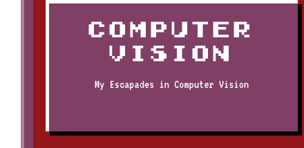</a><a href="https://github.com/McVarHQ/Unreal-Engine-Projects">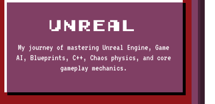</a>

<!-- ===================== PANEL 4: RADAR + TROPHIES + more(me) ===================== -->
<!-- One L-shaped composition cut into two open-edged pieces; more(me) nests in the pocket.
     panel4_radar.svg + panel4_trophies.svg are regenerated nightly by .github/workflows/radar.yml -->
<!-- prettier-ignore -->

<a href="./resume/"></a><a href="./credentials/"></a>

 
