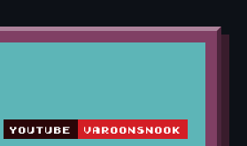

<!--
  SAMPLE README — Panel 1. Upload to repo root:
    panel1_left.svg, right_top.svg, right_bottom.svg
    (panel1_anim.svg only if you use the FALLBACK)

  Chips: YouTube (top), Email (bottom). Profile Views removed.

  FIXES vs last screenshot:
  - SCALE: GitHub stripped the inline style= (that broke sizing). This version uses
    ONLY width= attributes that GitHub keeps. Native sizes: left=600w, right pieces
    =279w. 600+279 = the real panel width, same scale, no drift.
  - GAP: the right half is now just TWO pieces with ONE seam, and that seam sits in
    the empty cyan band between the chips. Each piece is in its own borderless table
    row (cellspacing=0). One seam in cyan is far more forgiving than 5 strips.

  If it STILL shows a seam, use the FALLBACK at the bottom (one seamless SVG, not
  clickable) — that is the guaranteed option.
-->

<!-- ===== PRIMARY: clickable (YouTube top piece, Email bottom piece) ===== -->
<table cellspacing="0" cellpadding="0" border="0">
<tr>
<td rowspan="2" valign="top"></td>
<td valign="bottom"></td>
</tr>
<tr>
<td valign="top"></td>
</tr>
</table>

<!-- ===== FALLBACK (seamless, not clickable). Delete table above, uncomment:

-->
