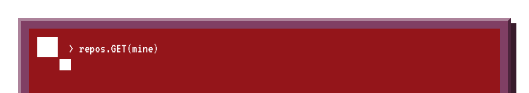

# Panel 3 flush + clickable test
Each card below is a **separate SVG wrapped in its own link**; the top/bottom strips are non-clickable. They are floated so they sit perfectly flush.

<!-- prettier-ignore -->

 
 
 
 
 

